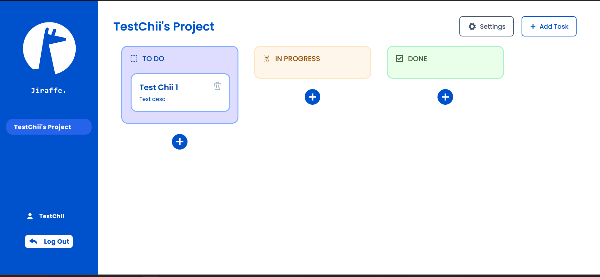

# Jiraffe



Task management tool for SWE3033 Software Processes.

[Live Website](https://jiraffe.vercel.app/login)

[Backend API](https://jiraffe-backend.onrender.com)

[Source Repository](https://github.com/ChiefWoods/jiraffe-task-management)

## Features

- Track tasks in a project
- Assign members to tasks

## Built With

### Language

- [](https://react.dev/)

### Packages

#### Frontend

- [](https://reactrouter.com/en/main)
- [](https://tailwindcss.com/)

#### Backend

- [](https://expressjs.com/)
- [](https://mongoosejs.com/)

### Database

- [](https://www.mongodb.com/)

### Test Library and Framework

- [](https://mswjs.io/)

- [](https://vitest.dev/)

### Bundler and Runtime

- [](https://vitejs.dev/)
- [](https://nodemon.io/)

### Linter & Formatter

- [](https://eslint.org/)
- [](https://prettier.io/)

### Tool

- [](https://code.visualstudio.com/)

## Getting Started

### Prerequisites

Update your npm package to the latest version.

```
npm install npm@latest -g
```

### Setup

1. Clone the repository

```
git clone https://github.com/ChiefWoods/jiraffe-task-management.git
```

2. Install all dependencies for `backend`

```
cd backend && npm install
```

3. Start Nodemon server

```
npm run start
```

4. In a new terminal, install all dependencies for `frontend`

```
cd frontend && npm install
```

5. Start development server

```
npm run dev
```

## Issues

View the [open issues](https://github.com/ChiefWoods/jiraffe-task-management/issues) for a full list of proposed features and known bugs.

## Acknowledgements

### Resources

- [Shields.io](https://shields.io/)
- [Google Fonts](https://fonts.google.com/)

### Hosting

- [Render](https://render.com/)
- [Vercel](https://vercel.com/home)

## Contact

[chii.yuen@hotmail.com](mailto:chii.yuen@hotmail.com)